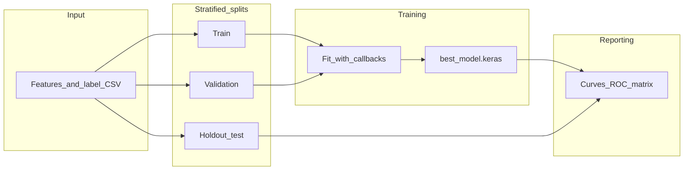

<div align="center">

# Emotions Predictions

### EEG emotion recognition with a deep GRU classifier

[](https://www.python.org/downloads/)
[](https://www.tensorflow.org/)
[](LICENSE)

Stratified **train · validation · test** splits, reproducible configuration, and a small CLI—so you can go from a labeled CSV to checkpoints, curves, and held-out metrics without leaking validation into your reported test scores.

[Getting started](#getting-started) · [Configuration](#configuration) · [Package layout](#package-layout) · [Contributing](CONTRIBUTING.md)

</div>

---

## Why this project exists

Many quick demos reuse the same split for **validation during training** and **final evaluation**. That inflates test scores. Here, validation drives early stopping and checkpointing; the **test set is touched only once** for confusion matrices, ROC, and reports. Splits are **stratified** by label, and one-hot targets use a **fixed class order** across folds so columns never drift between arrays.

> **In one sentence:** Train and tune on train + validation; believe the numbers you print from the holdout test.

---

## At a glance

| | |
| :-- | :-- |
| **Input** | CSV with a `label` column and numeric feature columns |
| **Model** | Keras GRU → dense softmax (multiclass) |
| **Stack** | TensorFlow 2.16, scikit-learn, pandas, Typer |
| **Outputs** | `best_model.keras`, training curves, ROC, confusion matrix (test only) |

---

## How data flows through the pipeline



---

## Getting started

### Requirements

- **Python 3.10, 3.11, or 3.12** (see `requires-python` in [`pyproject.toml`](pyproject.toml)). Python **3.13+** is not supported with the current TensorFlow pin.
- Your own **CSV** (this repo does not ship raw EEG tables).

### Install

```bash
python -m venv .venv
# Windows
.venv\Scripts\activate
# Linux / macOS
# source .venv/bin/activate

pip install -e ".[dev]"   # application + pytest, Ruff, pre-commit
# pip install -e .        # runtime only
```

Dependencies are pinned in [`pyproject.toml`](pyproject.toml); [`requirements.txt`](requirements.txt) mirrors them for `pip install -r` workflows.

### Run

**Recommended — CLI**

```bash
emotions-predictions train --data-path EEG-emotions.csv --output-dir outputs --no-plots
```

```bash
python -m emotions_predictions train --help
```

**Alternative — script entry**

```bash
python main.py
```

*(Requires an editable or regular install so `emotions_predictions` is importable.)*

---

## Data

Place **`EEG-emotions.csv`** in the working directory by default, or under [`data/`](data/) and pass `--data-path` / `EMOTIONS_DATA_PATH`.

| Rule | Detail |
|------|--------|
| **Label column** | Must be named exactly `label` |
| **Features** | All other columns are treated as numeric inputs |
| **Shipping** | No recording is bundled; bring your own file or regenerate from your protocol |

### Study scope (read before citing numbers)

The original protocol described **two participants**, a **Muse** montage (TP9, AF7, AF8, TP10), and a fixed stimulus set. Treat published metrics as **exploratory** unless you grow the cohort and pre-register analyses.

---

## Configuration

**Priority:** CLI flags for a single run, then environment variables, then defaults. Optional **`.env`** in the project root is loaded automatically (see [`config.py`](src/emotions_predictions/config.py)).

<details>
<summary><strong>Environment variables</strong> (prefix <code>EMOTIONS_</code>) — click to expand</summary>

| Variable | Role | Default |
|----------|------|---------|
| `EMOTIONS_DATA_PATH` | CSV path | `EEG-emotions.csv` |
| `EMOTIONS_OUTPUT_DIR` | Artifacts directory | `outputs` |
| `EMOTIONS_RANDOM_SEED` | Splits + library seeds | `48` |
| `EMOTIONS_TEST_FRACTION` | Holdout test fraction | `0.15` |
| `EMOTIONS_VAL_FRACTION` | Validation fraction of remainder | `0.15` |
| `EMOTIONS_LEARNING_RATE` | Adam LR | `0.001` |
| `EMOTIONS_BATCH_SIZE` | Batch size | `32` |
| `EMOTIONS_EPOCHS` | Max epochs | `100` |
| `EMOTIONS_EARLY_STOPPING_PATIENCE` | Early stopping on `val_loss` | `10` |
| `EMOTIONS_GRU_UNITS` | GRU width | `256` |
| `EMOTIONS_DROPOUT_RATE` | Dropout after flatten | `0.2` |
| `EMOTIONS_TENSORBOARD_LOGDIR` | Enable TensorBoard logs (optional) | *(unset)* |

Bounds and types are enforced in code.

</details>

---

## Outputs

Default directory: **`outputs/`**

| Artifact | Description |
|----------|-------------|
| `best_model.keras` | Checkpoint with best **validation** accuracy |
| `training_history.png` | Training vs. validation loss and accuracy |
| `roc.png` | One-vs-rest ROC on the **test** split |
| `confusion_matrix.png` | Confusion matrix on the **test** split |

The console prints test loss, accuracy, balanced accuracy, macro F1, and a full classification report.

---

## Reproducibility

[`seeds.set_random_seeds`](src/emotions_predictions/seeds.py) aligns Python, NumPy, and TensorFlow. Some **GPU** kernels remain nondeterministic; for the tightest repeatability during debugging, run on **CPU**.

---

## Package layout

Source lives under [`src/emotions_predictions/`](src/emotions_predictions/).

| Module | Responsibility |
|--------|----------------|
| [`data.py`](src/emotions_predictions/data.py) | CSV I/O, stratified splits, aligned one-hot labels |
| [`model.py`](src/emotions_predictions/model.py) | GRU architecture (compiled in training only) |
| [`training.py`](src/emotions_predictions/training.py) | Training loop, callbacks, `best_model.keras` |
| [`evaluation.py`](src/emotions_predictions/evaluation.py) | Held-out metrics and figures |
| [`config.py`](src/emotions_predictions/config.py) | Typed settings and env binding |
| [`pipeline.py`](src/emotions_predictions/pipeline.py) | End-to-end orchestration |
| [`cli.py`](src/emotions_predictions/cli.py) | Typer CLI (`emotions-predictions`) |
| [`seeds.py`](src/emotions_predictions/seeds.py) | Centralized random seeds |

**Entry points:** `python -m emotions_predictions` ([`__main__.py`](src/emotions_predictions/__main__.py)) · [`main.py`](main.py) (default pipeline)

---

## Development

Full notes live in **[`CONTRIBUTING.md`](CONTRIBUTING.md)**. Typical local checks:

```bash
ruff check src tests main.py
ruff format --check src tests main.py
pytest -m "not slow"
pytest -m slow    # optional TensorFlow smoke fit
```

`pre-commit install` runs Ruff on commit. CI (`.github/workflows/python-package.yml`) runs the same style gates and fast tests on Python 3.10–3.12.

---

## Dataset summary (original study)

| | |
| :-- | :-- |
| **Participants** | Two (one male, one female) |
| **States** | Positive, neutral, negative (~3 min each); additional resting neutral |
| **Hardware** | Muse headband · TP9, AF7, AF8, TP10 |

### Stimuli (excerpt)

| Valence | Examples |
|---------|----------|
| **Negative** | *Marley and Me* (death scene), *Up* (opening), *My Girl* (funeral) |
| **Positive** | *La La Land* (opening), *Slow Life* (nature), *Funny Dogs* (compilation) |

---

## Results

<p align="center">
  
</p>

---

## References

<details>
<summary>Bibliography (click to expand)</summary>

1. Cahn, B. R., & Polich, J. (2006). Meditation states and traits: EEG, ERP, and neuroimaging studies. *Psychological Bulletin*, 132(2), 180-211. [DOI](https://doi.org/10.1037/0033-2909.132.2.180)
2. Baijal, S., & Srinivasan, N. (2010). Theta activity and meditative states. *Cognitive Processing*, 11(1), 31-38. [DOI](https://doi.org/10.1007/s10339-009-0272-0)
3. DeLosAngeles, D., et al. (2016). Electroencephalographic correlates of concentrative meditation. *International Journal of Psychophysiology*, 110, 27-39. [DOI](https://doi.org/10.1016/j.ijpsycho.2016.09.020)
4. Deolindo, C. S., et al. (2020). Characterizing meditation through EEG. *Frontiers in Systems Neuroscience*, 14, 53. [DOI](https://doi.org/10.3389/fnsys.2020.00053)
5. Händel, B. F., et al. (2011). Alpha oscillations and inhibition. *Journal of Cognitive Neuroscience*, 23(9), 2494-2502. [DOI](https://doi.org/10.1162/jocn.2010.21557)
6. Kaur, C., & Singh, P. (2015). EEG dynamics during meditation. *Advances in Preventive Medicine*, 2015, 614723. [DOI](https://doi.org/10.1155/2015/614723)

</details>

---

## License

Released under the [MIT License](LICENSE).
